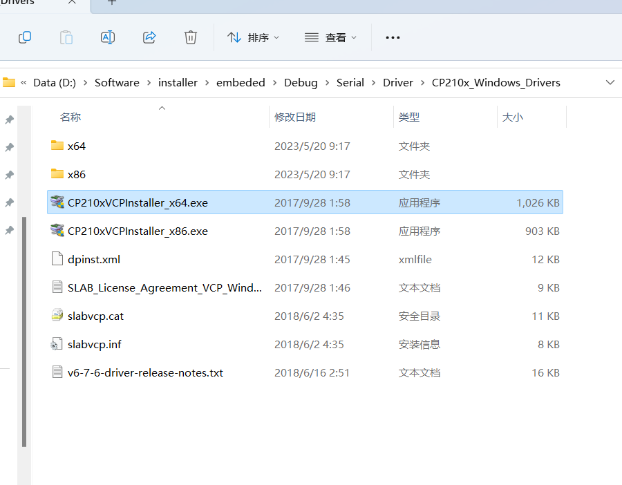

# ESP32H2 zigbee temperature sensor
## 环境搭建
### CP210x驱动
安装串口驱动

### esp-idf
wsl2安装ubuntu后，按照[乐鑫的idf手册](https://espressif-docs.readthedocs-hosted.com/projects/esp-idf/zh_CN/latest/get-started/index.html)安装。
windows中也可以按照上述手册安装工具，也可以自行安装esptool，用于烧录固件。
## 编写程序

以`esp-idf\examples\zigbee\light_sample\HA_on_off_light`为例程，进行后续的修改，制作一个温湿度传感器。

### config

使用sdk中预先定义的`ESP_ZB_DEFAULT_TEMPERATURE_SENSOR_CONFIG()`默认配置，创建一个`esp_zb_temperature_sensor_cfg_t`配置变量，然后使用`esp_zb_temperature_sensor_cfg_t`函数创建对应的终端节点实体，返回一个`esp_zb_ep_list_t`变量`esp_zb_ep_list_t`。

其中，节点链表的每个节点都包含`esp_zb_endpoint_t`成员，这个成员记录了zigbee协议终端节点的所有参数，例如简单描述符、cluster id列表、端点号等。上面调用`esp_zb_temperature_sensor_ep_create`函数，会根据前面的配置项，得到一个温度传感器的节点链表。其中有一些不经常改变的zigbee参数，都设置为默认的参数了，我们一般只需要修改`esp_zb_temperature_sensor_cfg_t`即可。

获取了节点链表`esp_zb_temp_sensor_ep`之后，可以使用节点链表`esp_zb_temp_sensor_ep`注册温湿度传感器设备。

```c
/**
 * @brief Type to represent ZCL endpoint definition structure
 * @note  The esp_zb_zcl_reporting_info_t defines see @ref esp_zb_zcl_reporting_info_s
* @note  The esp_zb_af_simple_desc_1_1_t defines see @ref esp_zb_af_simple_desc_1_1_s
 */
typedef struct esp_zb_endpoint_s {
    uint8_t ep_id;                              /*!< Endpoint ID */
    uint16_t profile_id;                        /*!< Application profile, which implemented on endpoint */
    esp_zb_callback_t device_handler;           /*!< endpoint specific callback, handles all commands for this endpoint. If set, it will be called to handle callback,like esp_zb_add_read_attr_resp_cb */
    esp_zb_callback_t identify_handler;         /*!< Identify notification callback. If set, it will be called on identification start and stop indicating start event with a non-zero argument*/
    uint8_t reserved_size;                      /*!< Unused parameter (reserved for future use) */
    void *reserved_ptr;                         /*!< Unused parameter (reserved for future use) */
    uint8_t cluster_count;                      /*!< Number of supported clusters */
    esp_zb_zcl_cluster_t *cluster_desc_list;    /*!< Supported clusters list */
    esp_zb_af_simple_desc_1_1_t *simple_desc;   /*!< Simple descriptor */
    uint8_t rep_info_count;                     /*!< Number of reporting info slots */
    esp_zb_zcl_reporting_info_t *reporting_info; /*!< Attributes reporting information */
    uint8_t cvc_alarm_count;          /*!< Number of continuous value change alarm slots */
    esp_zb_zcl_cvc_alarm_variables_t *cvc_alarm_info;   /*!< pointer to the cvc alarm structure */
} ESP_ZB_PACKED_STRUCT
esp_zb_endpoint_t;

/******************* endpoint list *******************/
/**
 * @brief The esp-zigbee data model of list of endpoint.
 *
 */
typedef struct esp_zb_ep_list_s {
    esp_zb_endpoint_t endpoint;                 /*!< A single endpoint */
    struct esp_zb_ep_list_s *next;              /*!< A pointer to next endpoint */
} esp_zb_ep_list_t;

```


